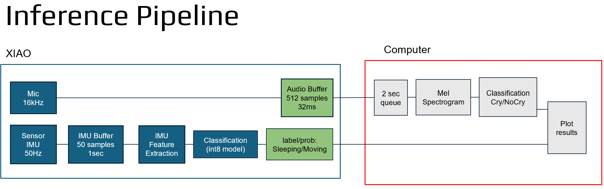
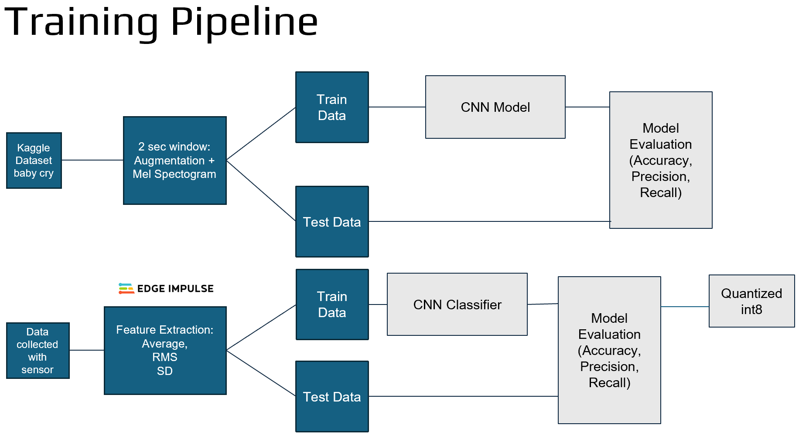

# Infant Monitoring Wearable Prototype

Real-time wearable monitoring prototype using audio and IMU sensing for infant state classification.

## Overview

This project implements a hybrid monitoring system combining:

- Audio classification running on a host computer
- IMU-based inference deployed on a Seeed Studio XIAO microcontroller

The system processes motion and audio signals in real time to detect and classify infant-related activity states through an embedded + host architecture.

---

## Features

- Real-time audio processing and classification
- Embedded IMU inference on XIAO microcontroller
- Serial communication between device and host
- Streamlit-based monitoring interface
- Audio and IMU exploratory analysis pipelines
- Edge Impulse deployment workflow

---

## System Architecture

The project is divided into two sensing pipelines:

### Audio Pipeline
- Audio preprocessing and feature extraction
- Audio classification using a trained PyTorch model
- Host-side inference and visualization

### IMU Pipeline
- Motion data acquisition from wearable device
- Embedded inference deployed with Edge Impulse
- Real-time serial streaming to the host application

---

## Repository Structure

- src/         Main application and processing modules
- firmware/    Arduino firmware and embedded deployment
- models/      Audio Trained model weights
- notebooks/   Audio and IMU exploratory analysis
- assets/      Diagrams, screenshots, and demo videos

--- 

## Hardware 
- Seeed Studio XIAO microcontroller
- IMU sensor
- Audio input / microphone
- Host computer for inference and visualization

---

## Engineering Challenges
- Real-time communication between host and microcontroller
- Embedded deployment constraints on the XIAO board
- Audio preprocessing latency
- Synchronization between audio and IMU pipelines
- Noise robustness in real-world environments

## Future Work
- Sensor fusion between audio and IMU predictions
- Fully on-device inference
- Battery-powered standalone wearable
- Extended real-world validation

## Demo
Interface and pipeline demonstrations are available in the assets/ folder.